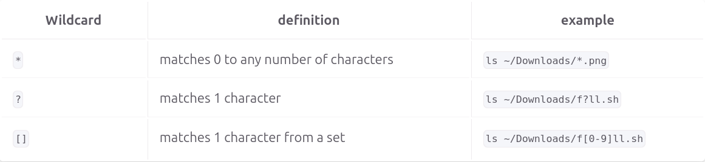

# Notes 6

## * (Star/Asterisk) Wildcard
* **Usage**
  * Used to match 0 to any number of characters.
* **Examples**
  * List all of the directories inside a given directory without listing their content.
    * `ls -1d wildcard_extra_practice/*/`
  * Move all the .sh files.
    * `mv wildcard_practice/*.sh wildcard_practice/scripts/`
  * List all files in the Downloads directory that has the .png file extension.
    * `ls ~/Downloads/*.png`

## ? (Question Mark) Wildcard
* **Usage**
  * Used to match 1 character.
* **Examples**
  * List all the files that contain a 4 letter file extension.
    * `ls -1X wildcard_practice/*.????`
  * List all the files that contain a 2 letter file extension and starts with letter j.
    * `ls -1X wildcard_practice/j*.??`
  * List all the Microsoft Office 365 files/
    * `ls -1X wildcard_practice/*.???x`

## [] (Square Brackets) Wildcard
* **Usage**
  * Used to match 1 character from a set.
* **Examples**
  * List all the files that start with a capital letter.
    * `ls wildcard_practice/[A-Z]*`
  * List all the files that contain a number in their name.
    * `ls wildcard_practice/[0-9]`
  * List all the files with a year in the name in yyyy format.
    * `ls [0-9][0-9][0-9][0-9]*`

## Table

## {} (Brace Expansion)
* **Usage**
  * Used to generate arbitrary strings to use with commands.
* **Examples**
  * Create a whole directory structure in a single command.
    * `mkdir -p music/{jazz,rock}/{mp3files,videos,oggfiles}/new{1..3}`
  * Create an N number of files.
    * `touch website{1-5}.html`
    * `touch file{A-Z}.txt`
  * Remove multiple files in a single directory
    * `rm -r {dir1,dir2,dir3,file.txt,file.py}`